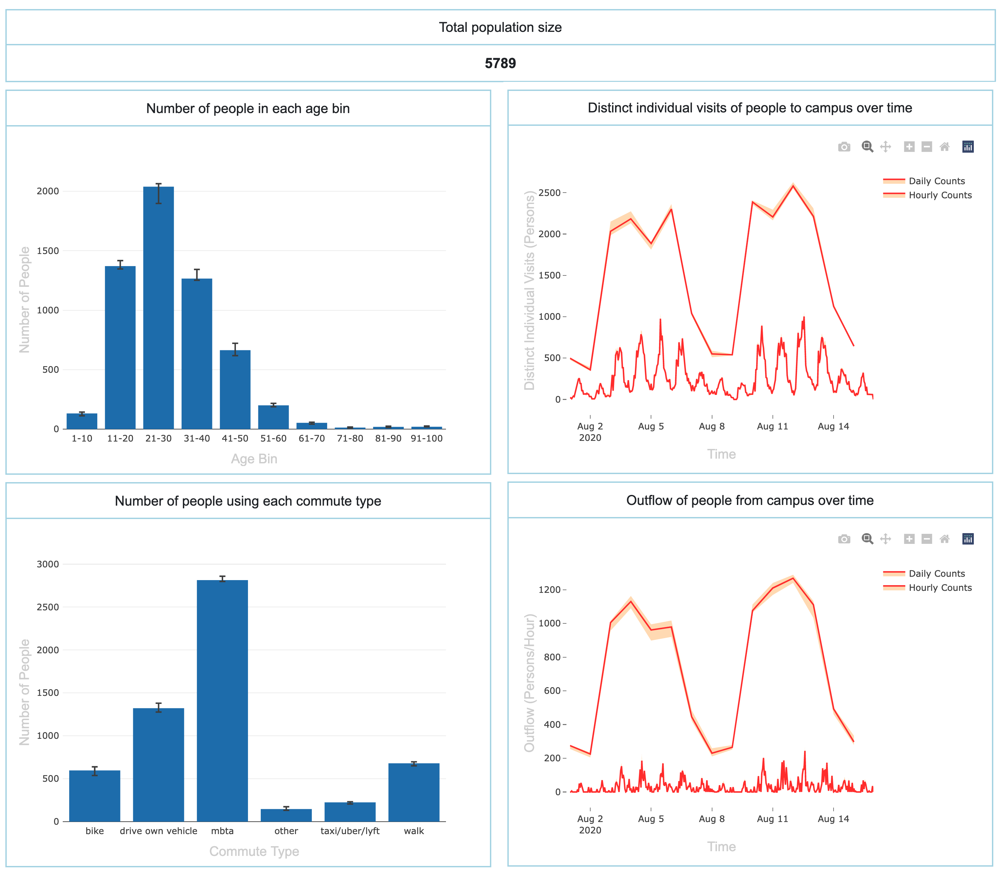
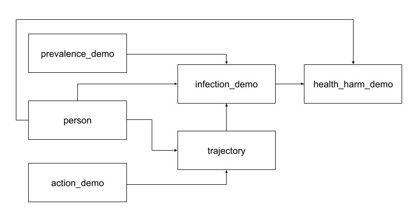
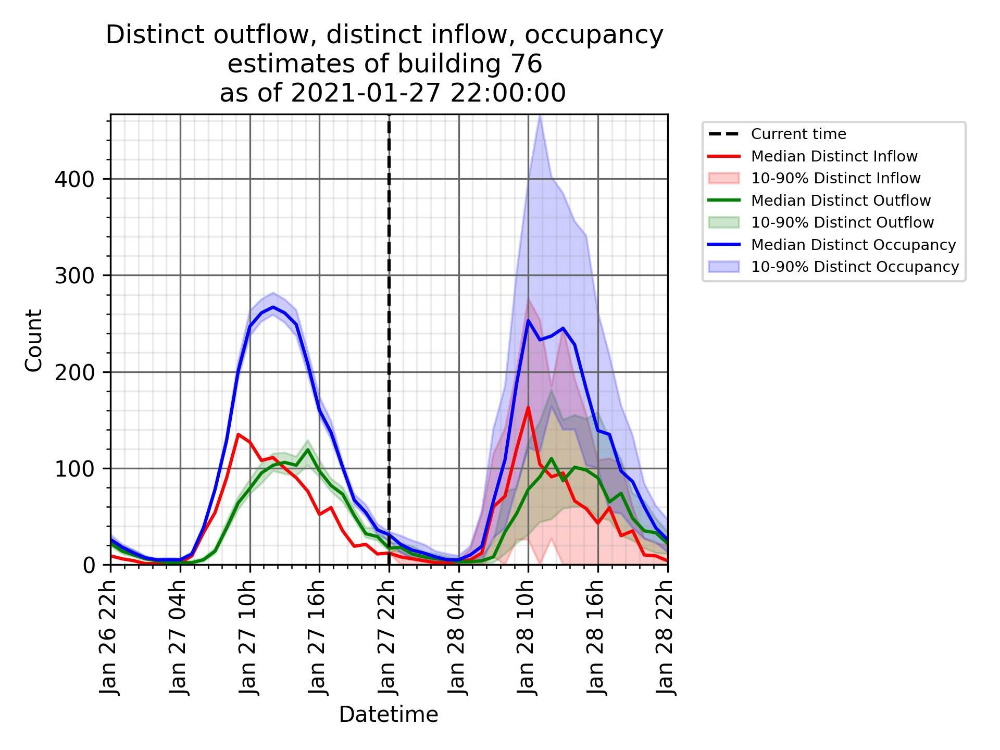

# COVID-19 Campus Simulation Systems

This repository contains the code required for running two complementary COVID-19 simulation system. The MIT COVID-19 Risk Model (RM) is used for longer term forecast and allows for prediction of infections and health outcomes. The MIT Situational awareness (SA) system is to take in rapidly updating data streams and simulate building occupancies for the near future so as to minimize exposure of people to the virus.

We architected the RM scenarios, models and analysis to maximize modularity: as long as each model and analysis respects the required input and output json structure, they can be composed and replaced as needed. In this release, we provide examples of each model type (`person`, `trajectory`, `action`, `infection` and `prevalence`) and example analyses modules as a way for other researchers to easily build their version of these models to fit their specific COVID-19 modeling needs.

You will notice that some of the models (e.g. the `person` and `trajectory` models) are much more developed than others. This is due to a variety of resaons ranging from privacy considerations to difficulties decoupling code from our computing infrastructure. However, even in the case of the minimal models, we share enough that one can build and adapt the models easily for their specific use case.

Both systems execute fully and produce meaningful results (JSON statistics) that can be visualized in the provided Flask-based UI.

Note: the code in this repository is a sanitized version of the actual running code - e.g. we have anonymized the data and removed code that handles integration with the actual system. Please see the the [technical report](static/technical_report.pdf) which contains more information about the sanitization and for the mathetical formalism behind the systems.


## 1. MIT COVID-19 Risk Model (RM)
The first system uses Monte-Carlo simulations to executes a `scenario` to forecast COVID-19 `health_harm` e.g. hospitalizations and deaths conditional on a variety of variables e.g. building access policy over time (`action` ). This system is computationally intensive and its primary purpose is to model the impact of different policies and prevalences on COVID-19 health outcomes.



As a brief summary, this system models the flow of people (each defined as a `person`sample with demographic, building assignments, and commuting attributes) walking through buildings (`trajectory` samples of people transiting between buildings each hour as a stochastic function of building openings, themselves samples of the `action` model), getting infected (`infection` samples are a stochastic function of local COVID-19 `prevalence` samples per zipcode, number of contacts based on `trajectory` samples, infection susceptibility based on `person` demographics) and the progress of these infections into `health_harm` samples. This is illustrated in the model dependency diagram below:




Please refer to the readme in [`scheduler/`](scheduler/README.md)  for more information about the Risk Model system.


## 2. MIT Situational awareness (SA)
The primary purpose of this system is to take in rapidly updating (~every hour) data streams and simulate building occupancies for the near future (e.g. the following week). It can be used, for example, to provide instantenous alerts about buildings that are expected to have high inflows and occupancies later in the day (based on current occupancy) for immediate policy actions.

As a brief summary, the system ingests the following high frequency data - card reader swipe counts, wifi-based building to building transition and stay duration times, and building assignment counts - builds distributions from them and uses Monte-Carlo simulations to   simulate future hourly buliding inflows, occupancies and outflows.



Please refer to the readme in [`situational_awareness/`](situational_awareness/README.md)  for more information about the Situational awareness system.

## Directory Overview

- `models`: Code for the RM `person`, `trajectory`, `action`, `infection` and `prevalence` models.
- `analyses`: Code for various RM analyses that can be performed after a scenario is run (the `analysis` computes statistics from the outcome of the `models`)
- `scheduler`: Code that performs RM scenario runs. A scenario comprises various models and analyses
- `tests`: RM unit and integration tests
- `local_outputs.zip`: example outputs from the RM and SA systems that need to be unzipped to be visualized in the UI.
- `situational_awareness`: code to run SA high-frequency building occupancy predictions
- `frontend`: UI to visualize RM and SA plots
- `static`: contains the Technical Report and figure images files for readme files.


## Minimum requirements

- Supported platforms: macOS, Windows, Ubuntu >=18.04
- Python 3.6


### Initial setup
Clone a local copy of the project
```sh
$ git clone https://github.com/mit-quest/COVID19-campus-modeling.git
```

Build and activate the virtual environment (this also installs python dependencies defined in `models/common/requirements.txt`)
```sh
$ cd COVID19-campus-modeling
$ make
$ source venv/bin/activate
```

### Clean up (if desired)
Clean up the virtual environment and temporary location simulation folders
```sh
$ make clean
```

### Contribution guide

To contribute to both sytems, please follow the guides here:

Risk model:
- [How to create new models](https://github.com/mit-quest/COVID19-campus-modeling/tree/main/models#creating-new-models)
- [How to create new analysis](https://github.com/mit-quest/COVID19-campus-modeling/tree/main/analyses#creating-new-analyses)
- [How to create new scenarios](https://github.com/mit-quest/COVID19-campus-modeling/tree/main/scheduler#creating-new-scenarios)

Situational awarenes model
- [How to contribute](https://github.com/mit-quest/COVID19-campus-modeling/tree/main/situational_awareness#how-to-contribute)

Submitting changes
- Make sure that the new code passes the unit tests
- Submit new code as PRs from a new branch

Contact email: [quest_covid19_campus_modeling@mit.edu](mailto:quest_covid19_campus_modeling@mit.edu?subject=[GitHub]%20covid%20open%20source)


