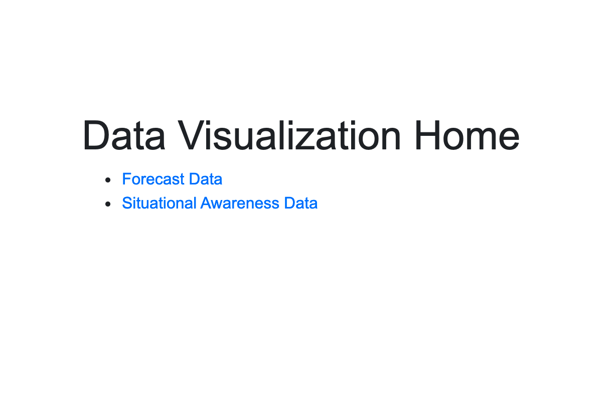
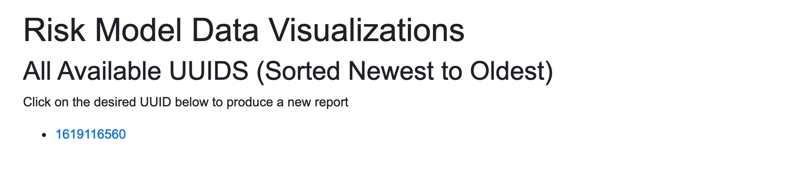
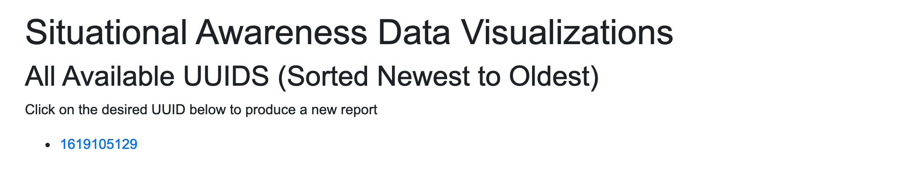
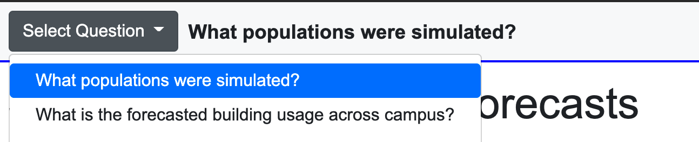

# Usage Guide
This is a flask-based web UI to display the output of both the Risk Model (RM) system and the Situational Awareness (SA) system.

To run from within `frontend/`:

`➜ python main.py`

The first window will ask you to pick the system you want to visualize:

<kbd>
  
</kbd>

The next screen is about choosing which simulation you want to visualize based on the output UUID (digits represent epoch time)

<kbd>
  
</kbd>

<kbd>
  
</kbd>

In the RM system, you can pick which question you want to visualize. The choices are:
- Demographics "What populations were being simulated"
- Campus and building usage: "What is the forecasted building usage across campus?"

<kbd>
  
</kbd>

Note: the provided output sample data (in `local_outputs.zip`) are very sparse and are for illustration purposes only. This also means that the plots will not contain much data.

## External endpoints

### /ping
test if server is running

### /
points to /forecast and /situational-awareness

### /forecast
this will present a list of available UUIDs that can be converted into a report

### /situational-awareness
this will present a list of available UUIDs that can be converted into a report

### /forecast?uuid=<uuid>
this will present a list of available UUIDs that can be converted into a report, and it will generate a report for the given UUID

### /situational-awareness?uuid=<uuid>
this will present a list of available UUIDs that can be converted into a report, and it will generate a report for the given UUID

## Internal endpoints

### /static
all the assets used by flask such as css and javascript

### /get-uuids/<type>
grabs the list of valid UUIDs from server file system for type = 'forecast' or 'situational-awareness'

### /get-data/<type>?uuid=<uuid>
grabs data from server and returns a large JSON string for type = 'forecast' or 'situational-awareness'

# Development Guide

## One Time Setup of Local Machine
  * install python3
  * `$ cd` into `frontend`
  * `$ pip install -r requirements.txt` (could/should be done in clean python environment) (`pip3` might be needed depending on system)

## Each Time

### Local Development
  * `$ cd` into `frontend`
  * `$ python main.py` (ensure you are in right environment if you are using one)
  * open web browser to `http://127.0.0.1:8080/ping`
    * hopefully you see `hello world` and that means flask server is working
  * open web browser to `http://127.0.0.1:8080/`
    * hopefully you see something that looks like a website

# JavaScript Framework
The whole site is a single-page web app (SWA) and everything follows from results.html which then calls the appropriate javascript files.
If you get confused, just start reading results.html and follow everything in order. app-ops.js has all the report content and structure.

## To add new top-level page
* add a page div (shown below) as direct child to #app in results.html
  * `
" data-title="<human-readable-title>" class="row page">`
* add h1 and/or any other content you want at the top of that element
* a top-level menu item will be created and activated for you
* if you do not want submenus, then add class `.page-without-submenu` to shift the page content up, otherwise add submenus as described below

## To make a page with second-level nav options (submenus)
* add the top-level page as described above
* add class `.page-with-submenu` to the page div
* add page nav block as direct child to the page div
  * it is best to copy contents from another page nav since you also need some nested elements and they are parsed programmatically to build pages, but the first element is `<nav class="col-12 navbar navbar-light bg-light question-submenu fixed-top">`
* add items into the nav
  * `<button type="button" class="dropdown-item btn btn-link"> Text you want to display to human </button>`
* content placeholders for each item will be added automatically so you can write to them using `addSectionBreak` and `initializeDataviz` from within `generateReport`

## To add new data and/or visualization
* in app-ops.js
  * handle data by following the examples at the end of `generateReport` using `if (<key> in allData) { do stuff with allData[<key>] }` which will likely call plotting functions in plot-ops.js
* in plot-ops
  * define new plotting function similar to `allPeopleChart`
  * add code in `updateDataviz` to call your new plotting function
  * add code in `initializeDataviz` to render controls and display options
  * ensure you have a page defined as described above
  * call `initializeDataviz` from within `generateReport` to add visualization onto the page
