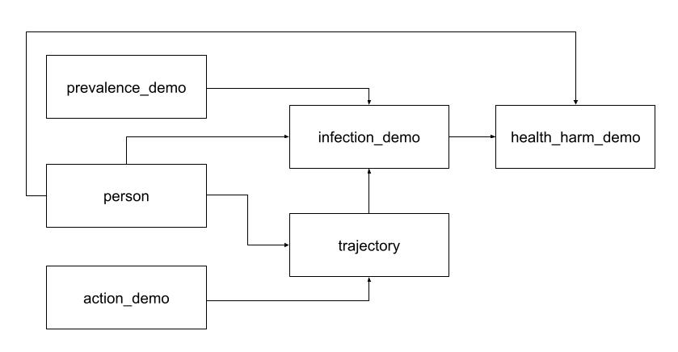

# Models

As you read thorugh the documentation of the models, it is important to remember that, fundamentally, all that matters for a model to exist is for it to implement the `Model` class (as defined in `models.common.model`) AND to respect the input/output JSON schemas.

Here, we detail our particular choice of how models are defined. However, one could easily create a new type of model, e.g. a 'vaccination' model that simulates vaccination campaigns and its effect or the other models.

The MCRS system is built using the following `model_types`:
- prevalence: Models that describe community prevalence of the virus. Here, `prevalence_demo` simulates the prevalence of a disease as simple random noise about and old state-level prevalence. This is where an SEIR model can either be implemented, or prevalence values, current and forecasted, can be queried from other models for the desired level of geographic and temporal resolution.
- action: Actions that MIT decision makers could take. Here, the `ActionDemo` model takes as input a percentage reopening of buildings, and, for each sample, stochastically assigns an opening percentage of this building, along with a timeline of reopening.
- person: Models that generate samples of desired population. Here, the `person` model creates samples of people, each with their own stochastical attributes.
- trajectory: Models that generate people's commute in and out of campus, along with their progression of 'stays' through buildings and their local_activities (e.g. going to lunch) for each day of the simulation. Here, the `trajectory` model implements generates trajectories, including for overnight stays (stays that span midnight). It does so by taking in the `person` samples and generating a trajectory for each day for each person. The `action` model samples are used to define if a person is allowed into a building.
- infection: Models that describe how individuals get infected over time. Here, the `infection_demo` model takes in the `trajectory` of a `person`, simulates their number of interactions and uses this number of interactions along with the local `prevalence` to simulate the number of infections. `person` samples could be used to refine probability of infection by demographics.
- health_harm: Models that describe the health harms experienced by individuals. Here, `health_harm_demo` produces samples of COVID-19 outcomes (infection, sickness, hospitalization, ICU care, death) based on `infection` sample and `person` samples (for demographics).




There also exists a `common` folder, which contains:
- Data that is used across multiple models (e.g. MIT building list)
- Common code utils (e.g. `model_runner.py`)
- Model templates (e.g. `new_model.py`, `new_config.json`, `new_Dockerfile`)

## Creating new models
Go into the relevant `<model_type>` folder
```sh
$ cd <model_type>
```
Create a new folder with your `<model_name>`
```sh
$ mkdir <model_name>
```
Copy the model and config templates to your new folder
```
$ cp ../common/new_model.py <model_name>/<model_fname>.py
$ cp ../common/new_config.json <model_name>/config.json
```
Modify the parameters in `config.json`:
> e.g. `model_type`, `model_name`, `model_id`, `model_pyfile`, `model_pyclass`, `input_models`, `model_parameters`

Modify the `sample` method in `<model_fname.py>`
> def sample(self,  t_0: str, n_samples: int, dates: list, input_samples: dict) -> dict:

Try running the model
```sh
$ cd ../
$ python run_model.py --io-dir models/<model_type>/example_jsons --config-file <config_file>
```

The model's output will then be written to the following files:
```
models/<model_type>/example_jsons/output_metadata.json
models/<model_type>/example_jsons/output_samples.json
```

## Important notes
### Input metadata and samples
If your model requires one or more input models, please include sample input metadata and samples json files in the `<model_type>/example_jsons` folder

This is required for the `test_model.py` integration tests to pass

For example, for the following `config.json`:
```json
{
    "model_type": "infection",
    "input_models": [
        {
            "model_type" : "action",
            "model_name" : "placeholder-mobility-restricting-action-model",
            "model_id" : "V0.01_2020-05-02"
        },
    ]
}
```

The following files need to be included:
```sh
infection/example_jsons/placeholder-mobility-restricting-action-model_metadata.json
infection/example_jsons/placeholder-mobility-restricting-action-model_samples.json
```

### Config schema validation
Each model must include a `config.json` file that adheres to the schema specified in `common/schema/config.schema`

To validate, run
```sh
$ jsonschema -i <config file> common/schema/config.schema
```

For more information on the various model JSON schemas, please refer to the [models schema README](common/schema/README.md)

### Random seed
If a random generator (e.g. `numpy`, `random`) is used in your model, you must use a random seed and define that value in `model_parameters` in `config.json`

This ensures that the model outputs are reproducible

To test reproducibility, add the model to `ModelRunner()` (see [Creating models](#Creating-new-python-only-models)), and run the unittests
```sh
$ cd ../
$ python -m unittest tests.test_model.TestModels
```
